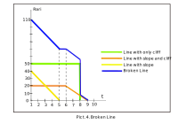

## Staking
#### Need to know before:
**bias** — amount of reserved Rari.

**cliff** — period in weeks, when bias value constant.

**slope** — amount of Rari by which bias will decrease per unit of time equal to one week, the rate of bias decrease.

**broken line** - the mathematical sum of all Locks, represented as a curve of the amount Rari / stRari over time.
### About
Staking contract - designed to reserve users **Rari** to the account of a smart contract.
Instead of **Rari**, the user is awarded **stRary** points, the sum of which determines 
the user's weight when voting for community decisions.

#### Creating Lock
Lock life mechanism with specified parameters (**bias**, **slope**, **cliff**) on a time scale clearly
displayed as a broken line. What type of line to choose and what parameters to set
the user decides. The user creates a Lock (Rari equal to the bias parameter
are transferred to the account of the contract) and selects the type of reservation picture 1.

The Lock life mechanism with the specified parameters (bias, slope, cliff) is visually displayed along the timeline 
as a broken line. The user decides which strategy to choose and which parameters to set. When creating a Lock,
Rari equal to the bias parameter are transferred to the contract account. Depending on the parameters, cliff and slope
Lock can be of 3 types:
only cliff,
cliff plus slope,
only slope.
For example, consider picture 1.

When creating the Lock Amount, **stRary** will be calculated using a special formula, but the form
the line will be similar to the **Rary** line, picture 2. 

It is important that if the user uses line type with cliff only, then the mechanism
no **Rary** output is provided until the end time of Lock. When using slope **Rary**
can be listed back to the user as shown in picture 3.

The user can create an unlimited number of Lock.
Each Lock created has a unique id. Moreover, with each creation
Lock increases the amount **Rari** and the amount **stRari**. Mechanism for changing any amount
Lock for **Rari** and stRari is visually displayed using broken line picure 4.

#### Modernize Lock

For each created Lock, you can execute the restake method, which allows you to overwrite the new Lock parameters,
the following parameters are available for changing: bias, cliff, slope, as shown in picture 5. It is important 
that the Lock completion time during restake is not less than the initial Lock period, otherwise restake will fail. 

It is important, if the withdraw operation was performed before the restake, or when the restake increases the bias 
to a high degree, then part of the missing Rari will be transferred from the user to the contract, as shown in picture 6.

Amount stRari when the stake method is executed is calculated by the formula:

stRari = k * Rari. 

K = (0.07 + 0.93 * (cliffPeriod / 104) ^ 2 + 0.5 * (0.07 + 0.93 * (slopePeriod / 104) ^ 2)) * 1000.

Amount stRari depends on the values of period cliff and period slope.
The K coefficient changes non-linearly, as shown in the picture 7. 
The longer the stake period, the more stRari the user will receive.

