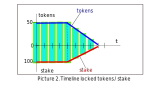
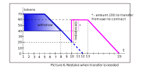

## Staking

This contract locks ERC-20 tokens and issues back staked tokens. These staked tokens are not transferrable, but they can be delegated to other users. Tokens unlock linearly. 

User locks tokens on `start` moment, amount of locked tokens is `bias`. In `cliff` period amount of locked tokens doesn't change, then it starts to decline linearly. 

Staked balance behaves pretty the same way, but initial `bias` is multiplied by `value k` calculated using `Stake` parameters (slope, cliff, bias etc.)

This contract is based on [LibBrokenLine](../broken-line/readme.md).

### Features

Functions supported for every user:
 - **stake** - create new `Stake`. Initial bias of the `Stake` depends on locked token amount and other parameters of the `Stake` (cliff, period etc.)
 - **reStake** - change parameters of the `Stake`. It's possible to extend period and increase locked amount
 - **withdraw** - withdraw unlocked ERC-20 tokens (if something is unlocked already)
 - **delegateTo** - delegates specific `Stake` to other user
 - **split** - TBD
 - **migrate** - this function can be called only in `Migration` state. Will migrate user's `Stakes` to new contract 

### Functions to read the data
 - **totalSupply**() - calculates sum of all staked balances
 - **balanceOf**(address account) - calculates current power for specified user (sums all his Stakes and all delegated Stakes)
 
### Functions for owner only
 - **stop**() - enter stopped state of the contract. Users can only withdraw tokens in this state. `Stakes` can not be created/modified.
 - **startMigration(address to)** - enter migration state of the contract. Owner specifies address of the new staking contract (it should implement specific interface). In this state users can migrate their `Stakes` to this new contract

#### Creating Stake

**stake** (address account, address delegate, uint amount, uint slope, uint cliff)

`Stake` can be of 3 types:
- only cliff,
- cliff plus slope,
- only slope.

For example, consider picture 1.

When creating the `Stake`, amount of `Stake` will be calculated using a special formula, but the function describing stake
balance will be almost the same as the function of locked tokens (it will be only multiplied by specific value) 

User can withdraw unlocked amount of tokens anytime, as shown in picture 3.

User can create unlimited number of `Stakes`.
Each Stake created has a unique *id*.
Total stake of the user is calculated as sum of all stakes delegated to him, consider picure 4.

#### Restake

**restake** (uint id, address newDelegate, uint newAmount, uint newSlope, uint newCliff) can be used to update parameters of the `Stake`.
Users are allowed to increase period and increase amount of tokens, example is shown in picture 5.

If there is not enough tokens locked for restake, then Staking contract will transfer needed amount of tokens from user account, as shown in picture 6.

Method restake will not run if cut corner original stake detects. To prevent cutting corners user need to set correct parameters (amount, slope, cliff) as shown in picture 7.

#### Delegation

Users can delegate their stake to other accounts. This can be done when creating (stake), updating (restake). 
Also, special function delegate can be used to delegate one Stake to other account without changing `Stake` parameters.

#### Stake value calculation

Stake value is calculated by the formula:

stake = K * tokens / 1000;

K = ( 11356800 + 9300 * (cliffPeriod)^2 + 4650 * (slopePeriod)^2) / 10816;

Stake value depends on the values of period cliff and period slope. The longer the stake period, the more stake 
the user will receive. Max staking period equal 2 years cliff period and 2 years slope period. 
The K coefficient changes non-linearly, as shown in the picture 8. 

##### Contract events
Staking contract emits these events:
- StakeCreate - when Stake is created
- Restate - when Stake parameters change
- Delegate - when Stake is delegated to other account
- Withdraw - when user withdraws tokens
- Migrate - when user migrates his stakes to new contract
